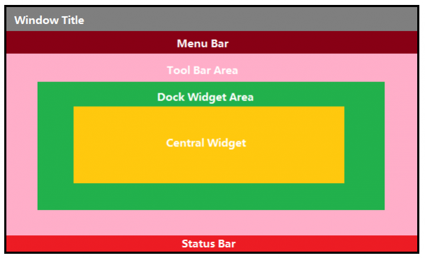
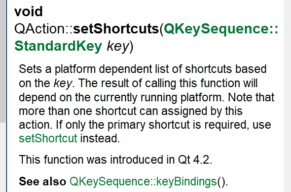
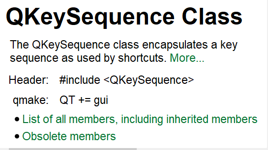
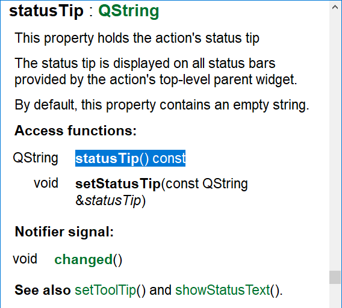

# day1

## MainWindow简介

> QMainWindow类提供一个有菜单条、工具栏、状态条的主应用程序窗口（例如：开发Qt常用的IDE-Visual Studio、Qt Creator等）。

> 一个主窗口提供了构建应用程序的用户界面框架。Qt拥有QMainWindow及其相关类来管理主窗口。

> QMainWindow拥有自己的布局，我们可以使用QMenuBar（菜单栏）、QToolBar（工具栏）、QStatusBar（状态栏）以及QDockWidget（悬浮窗体），布局有一个可由任何种类小窗口所占据的中心区域。


> QMainWindow是 Qt 框架带来的一个预定义好的主窗口类。所谓主窗口，就是一个普通意义上的应用程序（不是指游戏之类的那种）最顶层的窗口。比如你现在正在使用的浏览器，那么主窗口就是这个浏览器窗口。试着回想一下经典的主窗口，通常是由一个标题栏，一个菜单栏，若干工具栏和一个任务栏。在这些子组件之间则是我们的工作区。事实上，QMainWindow正是这样的一种布局。

Reference:[Qt学习之路2_MainWindow简介](https://www.devbean.net/2012/08/qt-study-road-2-mainwindow/)


## 窗口各个部分的划分



> 对于一般的 Qt 应用程序，我们所需要做的，就是编写我们的主窗口代码，主要是向其中添加各种组件，比如菜单、工具栏等，当然，最重要的就是当中的工作区。当我们将这些都处理完毕之后，基本上程序的工具也可以很好地实现。

> 通常我们的程序主窗口会继承自QMainWindow，以便获得QMainWindow提供的各种便利的函数。这也是 Qt Creator 生成的代码所做的。


## 添加动作

### QAction类

- 这个类代表了窗口的一个"动作";
    - 菜单
    - 工具栏
    - ...

- 动作的高度抽象


### 如何在QMainWindow中使用QAction

```Cpp
#include <QAction>
#include <QMenuBar>
#include <QMessageBox>
#include <QStatusBar>
#include <QToolBar>

#include "mainwindow.h"

MainWindow::MainWindow(QWidget *parent) :
    QMainWindow(parent)
{
    setWindowTitle(tr("Main Window"));

    openAction = new QAction(QIcon(":/images/doc-open"), tr("&Open..."), this);
    openAction->setShortcuts(QKeySequence::Open);
    openAction->setStatusTip(tr("Open an existing file"));
    connect(openAction, &QAction::triggered, this, &MainWindow::open);

    QMenu *file = menuBar()->addMenu(tr("&File"));
    file->addAction(openAction);

    QToolBar *toolBar = addToolBar(tr("&File"));
    toolBar->addAction(openAction);

    statusBar() ;
}

MainWindow::~MainWindow()
{
}

void MainWindow::open()
{
    QMessageBox::information(this, tr("Information"), tr("Open"));
}

```





QKeySequence 类封装了快捷键使用的按键序列。



此属性保存操作的状态提示
状态提示显示在动作的顶级父小部件提供的所有状态栏上。
默认情况下，此属性包含一个空字符串。


`QAction`第二个参数中，文本值前面有一个 &，意味着这将成为一个快捷键。注意看截图中 File 的 F 有一个下划线。

我们使用了setShortcut()函数，用于说明这个QAction的快捷键。Qt 的QKeySequence为我们定义了很多内置的快捷键，比如我们使用的 Open。你可以通过查阅 API 文档获得所有的快捷键列表。
