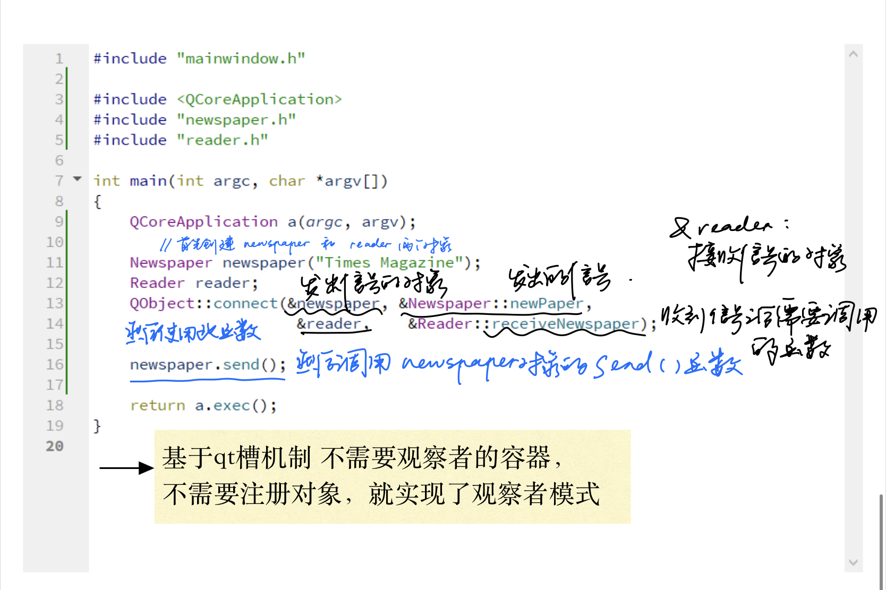

# day1

## HELLO WORLD!!


点击Run


其次的,这样会使label建立在堆上,(在app已知建立在栈上的情况下)生命周期混乱. label的生命周期不应当长于app的生命周期.

- 在 Qt 中，所有的`QPaintDevice`必须要在有`QApplication`实例的情况下创建和使用
    - `QLabel`继承自`QWidget`，`QWidget`则是`QPaintDevice`的子类

> 上面的代码不会有问题，是因为 app 退出时，label 已经关闭，这样的话，label 的所有QPaintDevice一般都不会被访问到了。但是，如果我们的程序，在 app 退出时，组件却没有关闭，这就会造成程序崩溃。（如果你想知道，怎样做才能让 app 退出时，组件却不退出，那么豆子可以告诉你，当你的程序在打开了一个网页的下拉框时关闭窗口，你的程序就会崩溃了！）

Reference: [Qt学习之路2_"Hello world"](https://www.devbean.net/2012/08/qt-study-road-2-hello-world/)


## 信号槽

信号槽 $\approx$ 观察者模式.

>  当某个事件发生之后，比如，按钮检测到自己被点击了一下，它就会发出一个信号（signal）。

>  这种发出是没有目的的，类似广播。如果有对象对这个信号感兴趣，它就会使用连接（connect）函数，意思是，用自己的一个函数（成为槽（slot））来处理这个信号。
>  也就是说，当信号发出时，被连接的槽函数会自动被回调。这就类似观察者模式：当发生了感兴趣的事件，某一个操作就会被自动触发。

(Qt 的信号槽使用了额外的处理来实现，并不是 GoF 经典的观察者模式的实现方式。)

### example

```Cpp

#include "mainwindow.h"

#include <QPushButton>
#include <QApplication>


int main(int argc, char *argv[])
{
    QApplication a(argc, argv);

    QPushButton quit_button("QUIT");
    QObject::connect(&quit_button, &QPushButton::clicked, &QApplication::quit);
    quit_button.show();


    return a.exec();
}

```


#### QObject::connect的重载


```Cpp
/****
    * sender : 发出信号的对象
    * signal : 发送对象发出的信号
    * receiver : 接收信号的对象
    * slot : 接收对象在接收到信号之后所需要调用的函数
****/

connect(sender, signal, receiver, slot);
```

> connect()函数，sender 和 receiver 没有什么区别，都是QObject指针；主要是 signal 和 slot 形式的区别

```Cpp
#include "mainwindow.h"

#include <QPushButton>
#include <QApplication>
#include <QDebug>


int main(int argc, char *argv[])
{
    QApplication a(argc, argv);

    QPushButton quit_button("QUIT");
//    QObject::connect(&quit_button, &QPushButton::clicked, &QApplication::quit);
    QObject::connect(&quit_button,&QPushButton::clicked,[](bool){
        qDebug() << "Clicked?";
    });//将一个对象的信号连接到Lambda表达式
    quit_button.show();


    return a.exec();
}
```


- 这里的Lambda表达式接收一个bool参数,这是因为`QPushButton`的`clicked()`信号实际上是有一个参数的.
- Lambda表达式中的`qDebug()`类似于`cout`,将后面的字符串打印到标准输出


## 自定义信号槽

> 经典的观察者模式在讲解举例的时候通常会举报纸和订阅者的例子。有一个报纸类Newspaper，有一个订阅者类Subscriber。Subscriber可以订阅Newspaper。这样，当Newspaper有了新的内容的时候，Subscriber可以立即得到通知。在这个例子中，观察者是Subscriber，被观察者是Newspaper。在经典的实现代码中，观察者会将自身注册到被观察者的一个容器中（比如subscriber.registerTo(newspaper)）。被观察者发生了任何变化的时候，会主动遍历这个容器，依次通知各个观察者（newspaper.notifyAllSubscribers()）。





