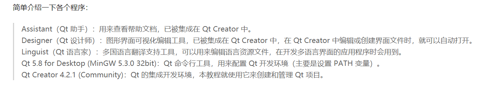

# day1

## Qt downloads

Reference:

> ?

[QT使用教程（二）之下载篇](https://zhuanlan.zhihu.com/p/121667682)

所以准备下载`5.14`的最新更新。

[Qt Downloads_5.14.2](https://download.qt.io/archive/qt/5.14/5.14.2/)

1. 注册Qt Account

注册就完了

2. 选择的组件

- Qt 5.14.2 选项下

[x] 编译器MinGW

[x] Qt开头的东西

- Tools选项下

[x] Debug用部分

接下来无脑Next即可.

