# day2

<!-- TOC depthFrom:1 depthTo:6 withLinks:1 updateOnSave:1 orderedList:0 -->

- [day2](#day2)
	- [资源文件](#资源文件)
		- [使用 QtCreator 创建资源文件](#使用-qtcreator-创建资源文件)

<!-- /TOC -->

## 资源文件

### 使用 QtCreator 创建资源文件

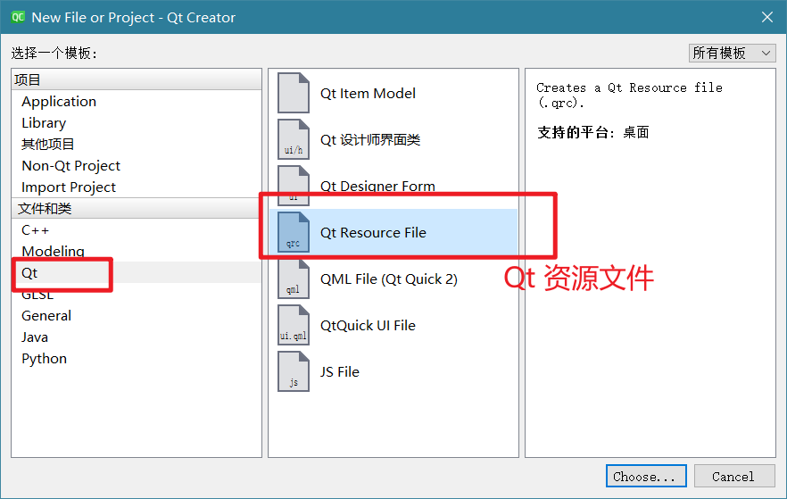

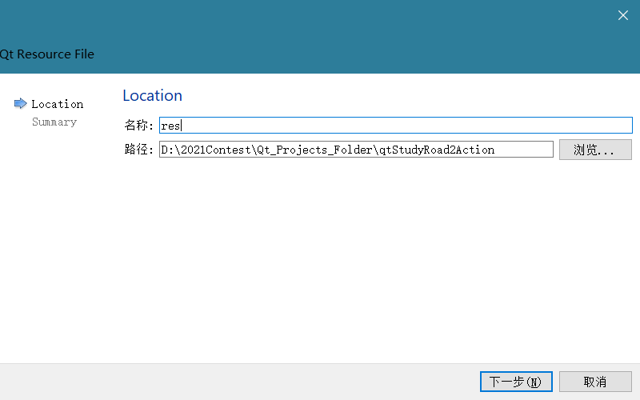

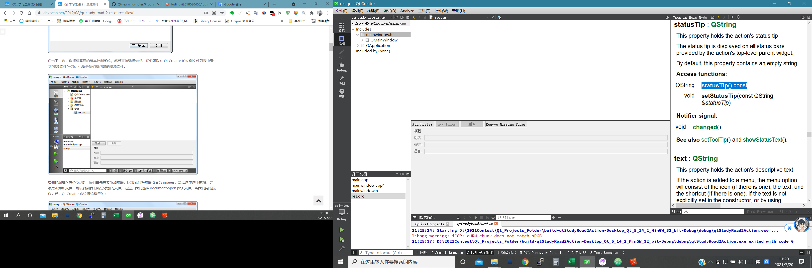

👆资源文件管理界面

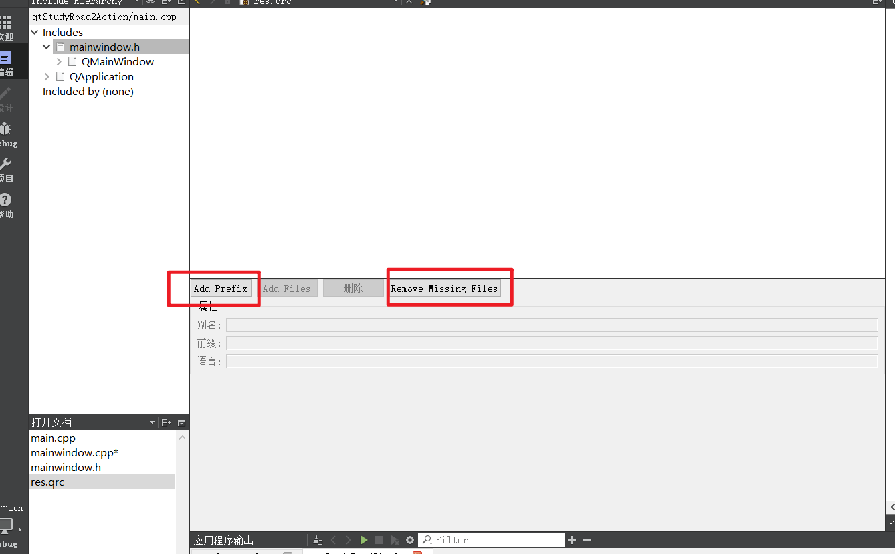

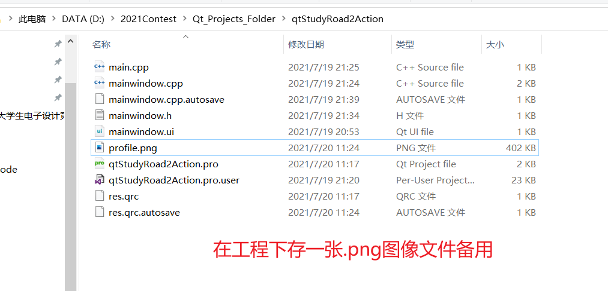

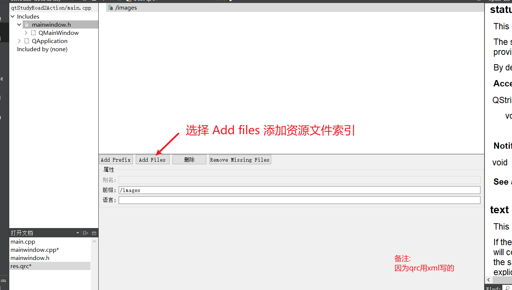

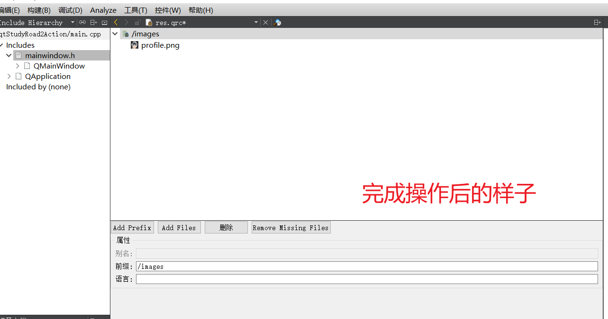

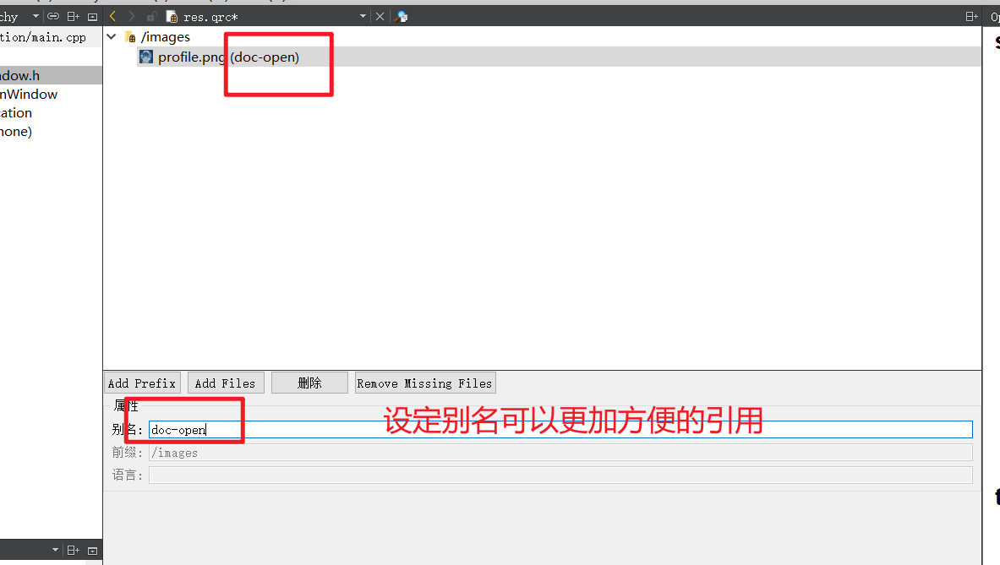

这样,我们可以直接使用`:/images/doc-open`引用到这个资源,无需关心图片的真实文件名.

也可以使用Language进行资源的国际化处理.

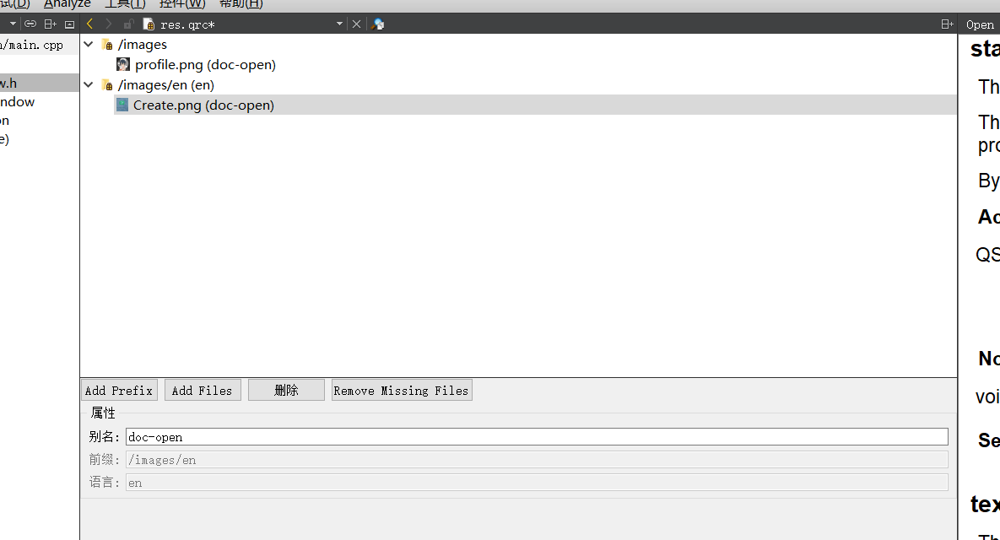

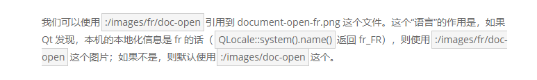

(fr->en即可)

此时再编译运行:

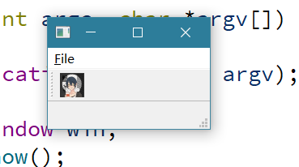

资源文件用`Notepad 3`打开后:

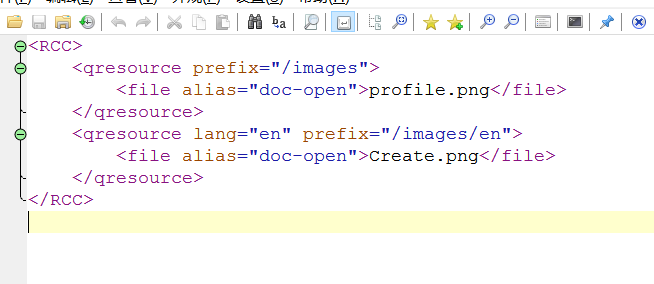

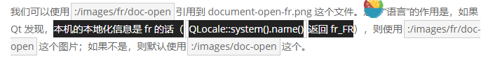
