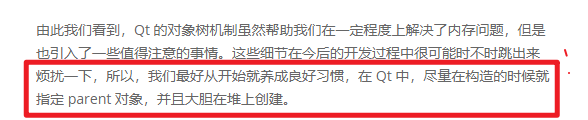

# day2

- Qt 的对象树

<!-- TOC depthFrom:1 depthTo:6 withLinks:1 updateOnSave:1 orderedList:0 -->

- [day2](#day2)
	- [MOC](#moc)
	- [parent指针](#parent指针)
- [include <iostream>](#include-iostream)

<!-- /TOC -->

## MOC

> 标准 C++ 对象模型在运行时效率方面卓有成效，但是在某些特定问题域下的静态特性就显得捉襟见肘。GUI 界面需要同时具有运行时的效率以及更高级别的灵活性。为了解决这一问题，Qt “扩展”了标准 C++。所谓“扩展”，实际是在使用标准 C++ 编译器编译 Qt 源程序之前，Qt 先使用一个叫做 moc（Meta Object Compiler，元对象编译器）的工具，先对 Qt 源代码进行一次预处理.
> * 注意，这个预处理与标准 C++ 的预处理有所不同。Qt 的 moc 预处理发生在标准 C++ 预处理器工作之前，并且 Qt 的 moc 预处理不是递归的。*


Reference: [The Meta-Object System_Qt Documentation](https://doc.qt.io/qt-5/metaobjects.html)

- 注意官方文档那个*第二点*:这告诉我们,只要通过继承`QObeject`类,就可以使用这些特性了.

- moc扩展了C++,让C++更适合进行GUI编程.


## parent指针

1. `QObject`是以对象树的形式组织起来的.
    - 当你创建一个`QObject`对象时，会看到`QObject`的构造函数接收一个`QObject`指针作为参数，这个参数就是 `parent`，也就是父对象指针。
    - 在创建`QObject`对象时，可以提供一个其父对象，我们创建的这个`QObject`对象会自动添加到其父对象的`children()`列表
        - 当父对象析构的时候，这个列表中的所有对象也会被析构
> eg. 一个按钮有一个`QShortcut`(快捷键)对象作为其子对象.当我们删除按钮时,这个快捷键理应被删除, **因为这些都是对话框的子组件**

2. `QWidget`是能够在屏幕上**显示的一切组件**的父类.
    - `QWidget`继承自`QObject`.
    - 一个孩子自动地成为父组件的一个子组件.
        - 显示在父组件的坐标系统中

> eg. 当用户关闭一个对话框的时候，应用程序将其删除，那么，我们希望属于这个对话框的按钮、图标等应该一起被删除。事实就是如此，因为这些都是对话框的子组件。

    - 我们也可以自己删除子对象，它们会自动从其父对象列表中删除.
- 可以使用`QObject::dumpObjectTree()`和`QObject::dumpObjectInfo()`这两个函数进行这方面的调试


→ Qt 引入**对象树**的概念,在一定程度上解决了**内存问题**.


补课: 析构函数


```Cpp
#include <iostream>

using namespace std;

class Line
{
   public:
      void setLength( double len );
      double getLength( void );
      Line();  // 这是构造函数

   private:
      double length;
};

// 成员函数定义，包括构造函数
Line::Line(void)
{
    cout << "Object is being created" << endl;
}

void Line::setLength( double len )
{
    length = len;
}

double Line::getLength( void )
{
    return length;
}
// 程序的主函数
int main( )
{
   Line line;

   // 设置长度
   line.setLength(6.0);
   cout << "Length of line : " << line.getLength() <<endl;

   return 0;
}
```


reference: [stackoverflow](https://stackoverflow.com/questions/9181782/why-are-the-terms-automatic-and-dynamic-preferred-over-the-terms-stack-and)

[stackoverflow](https://stackoverflow.com/questions/408670/stack-static-and-heap-in-c)




> **所以，我们最好从开始就养成良好习惯，在 Qt 中，尽量在构造的时候就指定 parent 对象，并且大胆在堆上创建。**

↑ !!!!
