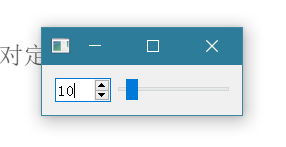
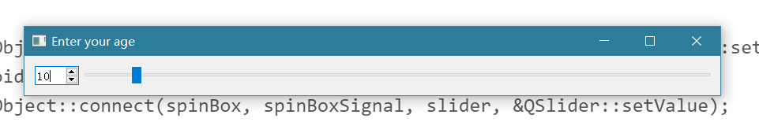
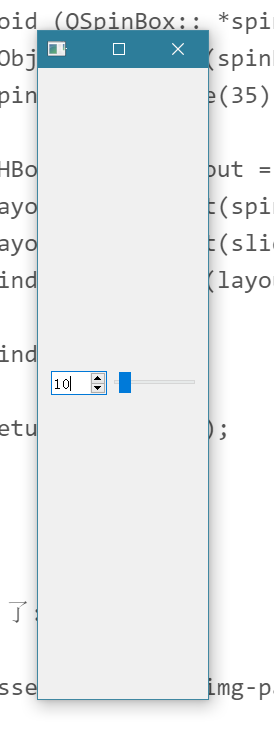

# day2

## 布局管理器

1. 绝对定位与布局定位

### slider,SpinBox



```Cpp
// !!! Qt 5
#include <QApplication>
#include <QWidget>
#include <QMainWindow>
#include <QSpinBox>
#include <QSlider>
#include <QHBoxLayout>
int main(int argc, char *argv[])
{
    QApplication app(argc, argv);

    QWidget window;
    window.setWindowTitle("Enter your age");

    QSpinBox *spinBox = new QSpinBox(&window);
    QSlider *slider = new QSlider(Qt::Horizontal, &window);
    spinBox->setRange(0, 130);
    slider->setRange(0, 130);

    QObject::connect(slider, &QSlider::valueChanged, spinBox, &QSpinBox::setValue);
    void (QSpinBox:: *spinBoxSignal)(int) = &QSpinBox::valueChanged;
    QObject::connect(spinBox, spinBoxSignal, slider, &QSlider::setValue);
    spinBox->setValue(35);

    QHBoxLayout *layout = new QHBoxLayout;//一个布局管理器
    layout->addWidget(spinBox);
    layout->addWidget(slider);
    window.setLayout(layout);

    window.show();

    return app.exec();
}

```

它 宽 了:



它

高

了:




总之,slider和SpinBox的相对位置一直没变.

## QPointer


